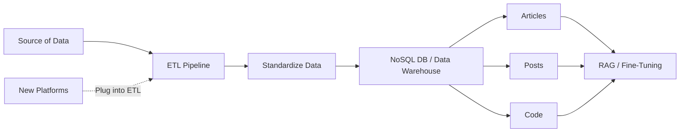
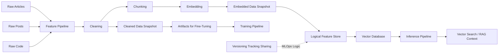
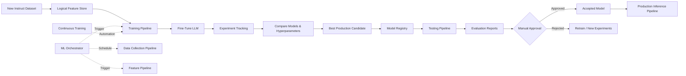
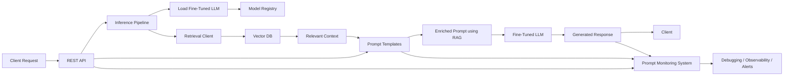

# The requirements of the ML system from a purely technical perspective
---
## 1. Data
- **Collect Data** (LinkedIn, Medium, Substack, and GitHub...) completely autonomously and on a schedule
- **Standardize the crawled data and store it in a data warehouse**
- **Clean the raw data**
- **Create instruct datasets for fine-tuning an LLM**
- **Chunk and embed the cleaned data. Store the vectorized data into a vector DB**
  **for RAG.**
## 2. Training
- **Fine-tune LLMs of various sizes (7B, 14B, 30B, or 70B parameters)**
- **Fine-tune on instruction datasets of multiple sizes**
- **Switch between LLM types (for example, between Mistral, Llama, and GPT)**
- **Track and compare experiments**
- **Test potential production LLM candidates before deploying them**
-  **Automatically start the training when new instruction datasets are available.**

## 3. **The inference code will have the following properties:**
- **A REST API interface for clients to interact with the LLM Twin**
- **Access to the vector DB in real time for RAG**
- **Inference with LLMs of various sizes**
- **Autoscaling based on user requests**
- **Automatically deploy the LLMs that pass the evaluation step.**

## 4. system will support the following LLMOps features:
- **Instruction dataset versioning, lineage, and reusability**
- **Model versioning, lineage, and reusability**
- **Experiment tracking**
- **Continuous training, continuous integration, and continuous delivery (CT/**
  **CI/CD)**
- **Prompt and system monitoring**

# How to design the LLM Twin architecture
---
The system is divided into four core components instead of only the three FTI pipelines because a separate data pipeline is also required. Typically, the data engineering team manages the data pipeline, while the ML engineering team manages the Feature, Training, and Inference pipelines.

## 1. Data Collection Pipeline
The data collection pipeline uses the ETL (Extract, Transform, Load) pattern to crawl personal data from platforms such as Medium, Substack, LinkedIn, and GitHub. After extraction, the data is standardized and stored in a NoSQL database, which acts as a data warehouse for raw ML-ready data. A NoSQL DB is chosen because the system mainly handles unstructured text data.

The collected data is organized by content type rather than by source platform:

- Articles → Medium, Substack
- Posts → LinkedIn
- Code → GitHub

This abstraction allows the ML system to process data based on its structure and usage instead of where it came from. Different categories require different processing strategies, such as different chunking methods for articles, posts, and code when used in fine-tuning or RAG systems.

The architecture is modular, so new platforms can be added easily by attaching another ETL pipeline without modifying the rest of the system. For example:

- X (Twitter) data can be added to the posts category
- GitLab data can be added to the code category

This design improves scalability, flexibility, and maintainability of the ML data infrastructure.

## 2. Feature Pipeline
The feature pipeline in the LLM Twin architecture is responsible for taking raw digital data (articles, posts, and code) from the data warehouse, processing it, and storing the processed outputs inside a logical feature store so they can later be used by both the training and inference pipelines.

The pipeline handles three distinct data categories:

- Articles
- Posts
- Code

Each category is processed differently because their structure and downstream usage differ. For example, chunking strategies for code are different from those for social media posts or long-form articles.

The feature pipeline contains three core processing stages:

1. Cleaning → removes noise and standardizes the data
2. Chunking → splits data into smaller meaningful pieces
3. Embedding → converts chunks into vector representations

The system creates two important snapshots of the data:

- Cleaned data snapshot → used for fine-tuning
- Embedded data snapshot → used for RAG systems and semantic search

Instead of using a dedicated feature store technology, the architecture uses a logical feature store built on top of a vector database. The vector DB acts both as:

- a vector search engine for inference
- and a lightweight NoSQL-like storage system

The vector DB can retrieve data points directly using IDs and collections without requiring vector search. Additional MLOps logic wraps this data into versioned and trackable artifacts, making the data:

- versioned
- shareable
- reproducible
- traceable

The two downstream consumers interact with the logical feature store differently:

- Training Pipeline → accesses instruct datasets as artifacts for offline training
- Inference Pipeline → queries the vector DB using vector similarity search for real-time contextual retrieval

This architecture works well because:

- Artifacts are optimized for offline training workloads
- Vector databases are optimized for online inference and retrieval

Overall, the feature pipeline transforms raw unstructured digital content into structured, embedded, and reusable ML-ready representations that power fine-tuning and RAG workflows.

## 3. Training Pipeline
The training pipeline consumes instruct datasets from the logical feature store and uses them to fine-tune an LLM. Whenever a new instruct dataset becomes available, the training pipeline is automatically triggered to start the fine-tuning process.

During the early experimentation phase, the data science team is responsible for:

- running multiple training experiments
- testing different LLMs
- tuning hyperparameters manually or automatically
- comparing experiment results

An experiment tracker is used to log and compare:

- hyperparameters
- metrics
- model performance
- training configurations

After experimentation, the best-performing model and hyperparameters are selected as the production candidate and stored in the model registry.

Once the optimal setup is discovered, the process becomes automated through Continuous Training (CT), allowing the system to retrain models automatically whenever new training datasets appear.

Before deployment, the candidate model goes through a dedicated testing pipeline with stricter evaluations than those used during training. The goal is to ensure the new model performs better than the current production model.

Even in highly automated systems, a manual approval step is recommended before production deployment. An expert reviews generated evaluation reports and decides whether the model should be accepted.

If approved:

- the model is tagged as accepted
- deployed to the inference pipeline
- and becomes the new production model

The pipeline also focuses on important LLM engineering challenges such as:

- building LLM-agnostic pipelines
- choosing fine-tuning techniques
- scaling training across different model sizes
- selecting the best production candidate
- evaluating whether a model is production-ready

The whole architecture is orchestrated using an ML orchestrator capable of:

- scheduling data collection jobs
- triggering feature pipelines when new data arrives
- triggering training pipelines when new instruct datasets are created

This creates a fully modular and event-driven continuous ML workflow.

## 4. Inference Pipeline
he inference pipeline is the final component of the LLM Twin architecture and is responsible for serving predictions and answering user queries in real time. It connects to both the model registry and the logical feature store.

From the model registry, the pipeline loads the fine-tuned LLM, while from the logical feature store it accesses the vector database used for Retrieval-Augmented Generation (RAG).

The workflow begins when a client sends a request through a REST API. The inference pipeline then:

1. receives the query
2. performs vector search on the vector DB to retrieve relevant context
3. enriches the prompt using RAG techniques
4. sends the final prompt to the fine-tuned LLM
5. generates an answer and returns it to the client

The system also includes a prompt monitoring component that logs:

- user queries
- retrieved context
- enriched prompts
- generated responses

This monitoring system is important for:

- debugging
- observability
- analyzing model behavior
- improving prompt quality
- detecting failures or hallucinations

Depending on system requirements, the monitoring system can trigger alarms or automated actions when issues are detected.

Although the pipeline follows the FTI architecture at a high level, internally it contains several LLM- and RAG-specific components such as:

- a retrieval client for vector searches
- prompt templates for formatting LLM inputs
- prompt monitoring tools for observability and evaluation

Overall, the inference pipeline combines:

- REST APIs
- vector retrieval
- prompt engineering
- LLM generation
- monitoring systems

to provide scalable real-time intelligent responses.

# Next Step
---
Summary for chapter 1: [[Summary For Chapter 1]]
For chapter 2 Go to : [[index]]
